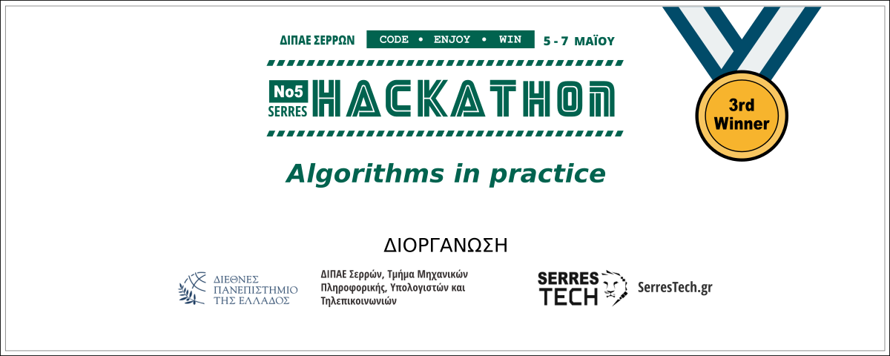
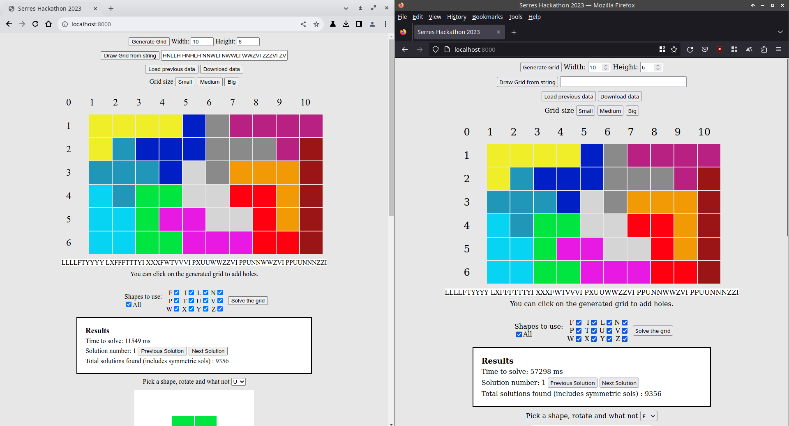

# SerresHack 2023 solution - Ang-Lia Team
Solving the [SerresHack 2023](https://hackathon.serrestech.gr) Pentomino [related topic](https://github.com/serrestech/hackathon-topic).

# Live test
Open up index.html with any modern browser. You can try a live version [here](https://lia-mon.github.io/hackathon-serres/)

# Algorithm used
This project attempts to solve the problem by reducing to an exact cover problem. The exact cover equivalent matrix is generated by making each row of the matrix correspond to a possible position of a shape on the given grid. 

As an example for a 10 x 6 grid, we enumerate each square. So given 12 different shapes (pentaminoes), each possible position for the shape to be placed will correspond to 72-wide row, where the first 12 fields correspond to the shape used. The other 60 fields will correspond to the position on the grid.

This approach can be done for any given grid (with or without 'holes') and every type of shape (not necessarily pentaminoes).

We then apply Donald Knuth's Algorithm X with the Dancing Links technique on the matrix to find the solution.

# Images

ah btw the v8 engine is plenty faster for this compared to firefox ; _ ; (nearly 6 times)

## License

[MIT](LICENSE)
