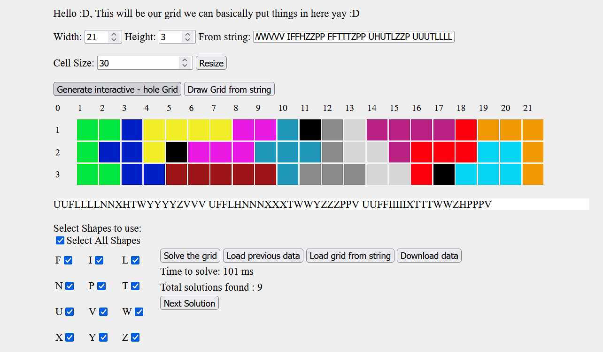
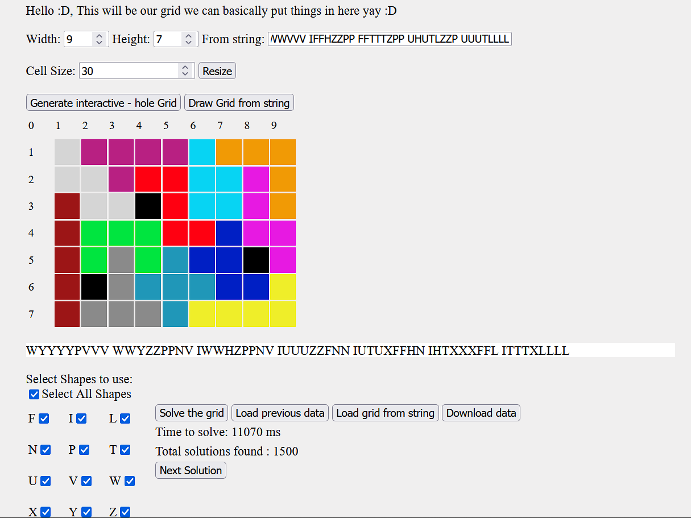

# Live test
Open up [start.html](../master/start.html) with any modern browser. Make sure you have all the files.

# Algorithm used
This project attempts to solve the problem by reducing to an exact cover problem. The exact cover equivalent matrix is generated by making each row of the matrix correspond to a possible position of a shape on the given grid. 

Example for an 10 x 6 grid, we enumerate each square. So given 12 different shapes (pentaminoes), each possible position for the shape to be placed will correspond to 72-wide row, where the first 12 fields correspond to the shape used. The other 60 fields will correspond to the position on the grid.

We can do this for any given grid (with holes etc) and every type of shape (not just pentaminoes or just 12 shapes used).

We then apply Donald Knuth's Algorithm X with the Dancing Links technique on the matrix to find the solution.

# Images

## License

[MIT](LICENSE)
